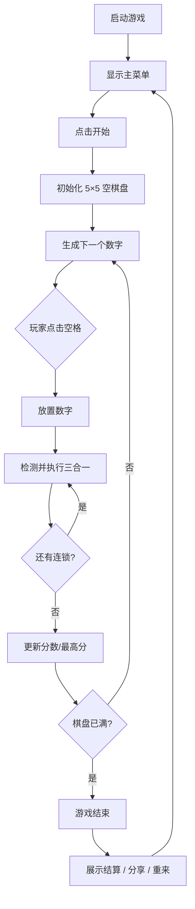

# 数字三合 — 微信小游戏设计方案

## 一、游戏概述

| 项目 | 说明 |
|------|------|
| 名称 | 数字三合 |
| 类型 | 休闲益智 / 三合一合成 |
| 平台 | 微信小游戏 |
| 核心体验 | 在棋盘上放置数字，三个相同数字相邻即合成更大数字，追求高分与最高数字 |

灵感来源：Triple Town（三合一城镇）、Drop Number（掉落数字）等经典合成玩法。

---

## 二、核心玩法

### 2.1 基本规则

1. 棋盘为 **5×5** 格子，初始为空。
2. 屏幕下方显示 **下一个待放置数字**（初始池：1、1、2，按权重随机）。
3. 玩家点击空格，将数字放入该格。
4. **三合一**：横或竖方向相邻的 **≥3 个相同数字** 会合并为 **1 个** 数字，数值 **+1**。
   - 例：三个 `3` → 一个 `4`
   - 四个 `3` → 一个 `4` + 一个 `3`（多出的不合并）
   - 五个 `3` → 一个 `4` + 一个 `3`（3+2 分组）
5. 合并后可触发 **连锁反应**，直到棋盘稳定。
6. 棋盘 **满格且无法放置** 时游戏结束。

### 2.2 数字体系

| 等级 | 数值 | 颜色主题 |
|------|------|----------|
| Lv1 | 1 | 浅蓝 |
| Lv2 | 2 | 天蓝 |
| Lv3 | 3 | 青绿 |
| Lv4 | 4 | 翠绿 |
| Lv5 | 5 | 黄绿 |
| Lv6 | 6 | 金黄 |
| Lv7 | 7 | 橙色 |
| Lv8 | 8 | 珊瑚 |
| Lv9 | 9 | 玫红 |
| Lv10+ | 10+ | 渐变紫 → 金 |

理论无上限，UI 对 ≥10 使用统一高亮色。

### 2.3 计分规则

```
单次合并得分 = 新数字 × 合并组数
例：三个 5 合成一个 6 → 6 × 1 = 6 分
    六个 3 合成两个 4 → 4 × 2 = 8 分
连锁加成：同一回合内第 n 次合并 × (1 + 0.1×(n-1))
```

### 2.4 待放置数字池

| 数字 | 权重 | 解锁条件 |
|------|------|----------|
| 1 | 50% | 默认 |
| 2 | 35% | 默认 |
| 3 | 15% | 单局最高分 ≥ 50 |

高级模式可加入 `4`（权重 5%，最高分 ≥ 200 解锁）。

---

## 三、游戏流程



---

## 四、界面设计

### 4.1 主界面布局（竖屏）

```
┌─────────────────────────┐
│  分数: 128    最高: 256  │  ← 顶栏
├─────────────────────────┤
│                         │
│      5 × 5 棋盘区域      │  ← 居中，圆角格子
│                         │
├─────────────────────────┤
│   下一个:  [ 2 ]         │  ← 待放置预览
├─────────────────────────┤
│  [重新开始]    [分享]    │  ← 底栏按钮
└─────────────────────────┘
```

### 4.2 视觉风格

- 背景：深蓝渐变 `#1a1a2e` → `#16213e`
- 格子：半透明圆角矩形，空格子有微弱边框
- 数字：粗体白色，带轻微阴影
- 合并动画：缩放弹跳 + 粒子闪烁（0.3s）
- 放置动画：从下方飞入（0.2s）

### 4.3 状态页

- **游戏中**：棋盘 + 分数
- **暂停**（可选）：半透明遮罩
- **结算**：本局得分、最高数字、历史最高、看广告复活（预留）

---

## 五、技术架构

```
merge-number-game/
├── game.js              # 入口
├── game.json            # 小游戏配置
├── project.config.json  # 开发者工具配置
└── js/
    ├── main.js          # 主循环与场景管理
    ├── config.js        # 常量与数值配置
    ├── board.js         # 棋盘数据与放置
    ├── merge.js         # 三合一检测与连锁
    ├── renderer.js      # Canvas 绑制
    ├── input.js         # 触摸输入
    └── storage.js       # 本地存档（wx.setStorage）
```

### 5.1 核心算法：三合一合并

1. 扫描棋盘，用 BFS/DFS 找四连通相同数字区域。
2. 区域大小 ≥ 3 时，`mergeCount = floor(size / 3)`。
3. 在区域「重心格」（或最先发现的格）生成 `value + 1`，其余格清空；余数 `size % 3` 保留原数字。
4. 重复扫描直到无合并（连锁）。

### 5.2 微信能力接入

| 能力 | 用途 |
|------|------|
| `wx.setStorage` | 保存最高分、设置 |
| `wx.getUserCloudStorage` | 好友排行榜（二期） |
| `wx.shareAppMessage` | 分享成绩 |
| `wx.createBannerAd` | 底部 Banner（变现） |
| `wx.createRewardedVideoAd` | 看广告复活一次（变现） |

---

## 六、留存与变现

### 6.1 留存设计

- **每日挑战**：固定种子棋盘，全服同题比高分
- **成就系统**：首次合成 7、单局 1000 分等
- **最高分本地记录** + 好友榜

### 6.2 变现（轻量）

- Banner 广告（非对局关键时刻）
- 激励视频：复活一次 / 换一个更好的下一个数字

---

## 七、开发里程碑

| 阶段 | 内容 | 状态 |
|------|------|------|
| M1 | 核心棋盘 + 三合一 + 计分 | ✅ 本仓库已实现 |
| M2 | 动画、音效、合并粒子 | 待做 |
| M3 | 分享、排行榜、广告 | 待做 |
| M4 | 每日挑战、成就 | 待做 |

---

## 八、快速上手

1. 用 [微信开发者工具](https://developers.weixin.qq.com/miniprogram/dev/devtools/download.html) 导入 `merge-number-game` 目录。
2. 填写自己的 AppID（测试可用测试号）。
3. 编译运行即可在模拟器/真机试玩。
